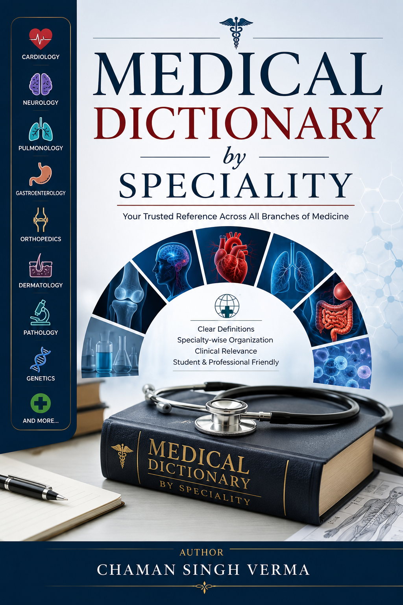

# Medical Dictionary by Specialty

A comprehensive medical dictionary organised by 43 medical specialties, not alphabetically. **6,445 entries** across **1,113 pages**, built with LaTeX.



## Structure

| # | Specialty | Entries | # | Specialty | Entries |
|---|-----------|---:|---|-----------|---:|
| 1 | Anatomy | 351 | 23 | Nephrology | 152 |
| 2 | Anesthesiology | 106 | 24 | Neurology | 188 |
| 3 | Biochemistry | 93 | 25 | Nuclear Medicine | 49 |
| 4 | Cardiology | 295 | 26 | Obstetrics & Gynecology | 476 |
| 5 | Clinical Nutrition | 51 | 27 | Oncology | 98 |
| 6 | Dentistry | 50 | 28 | Ophthalmology | 141 |
| 7 | Dermatology | 209 | 29 | Orthopedics | 125 |
| 8 | ENT | 135 | 30 | Pathology | 146 |
| 9 | Emergency Medicine | 89 | 31 | Pediatrics | 253 |
| 10 | Endocrinology | 209 | 32 | Pharmacology | 497 |
| 11 | Forensic Medicine | 106 | 33 | Physiology | 184 |
| 12 | Gastroenterology | 284 | 34 | Psychiatry | 195 |
| 13 | General | 3 | 35 | Public Health | 85 |
| 14 | Genetics | 83 | 36 | Pulmonology | 311 |
| 15 | Geriatrics | 50 | 37 | Radiology | 84 |
| 16 | Hematology | 128 | 38 | Rehabilitation | 49 |
| 17 | Immunology | 105 | 39 | Rheumatology | 87 |
| 18 | Infectious Disease | 193 | 40 | Surgery | 118 |
| 19 | Medical Implants | 37 | 41 | Toxicology | 49 |
| 20 | Medical Instruments | 81 | 42 | Urology | 58 |
| 21 | Medical Tests | 183 | 43 | Vascular Surgery | 50 |
| 22 | Microbiology | 209 | | **Total** | **6,445** |

## Build

```bash
pdflatex med_dictionary.tex
makeindex med_dictionary.idx
pdflatex med_dictionary.tex
```

## Author

Chaman Singh Verma
