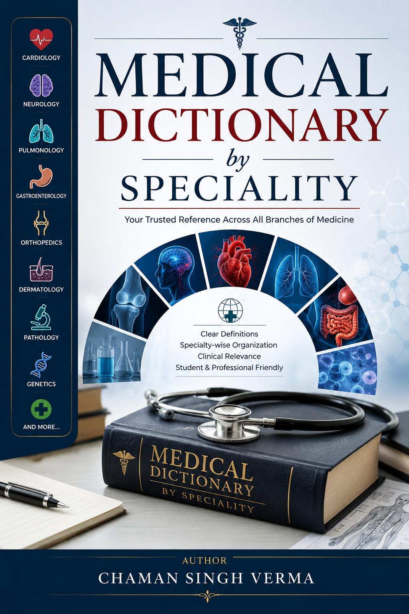

# Medical Dictionary by Specialty

A comprehensive medical dictionary organised by 43 medical specialties, not alphabetically. **11,118 entries**, built with LaTeX.



## Structure

| # | Specialty | Entries | # | Specialty | Entries |
|---|-----------|---:|---|-----------|---:|
| 1 | Anatomy | 500 | 23 | Nephrology | 192 |
| 2 | Anesthesiology | 122 | 24 | Neurology | 323 |
| 3 | Biochemistry | 208 | 25 | Nuclear Medicine | 171 |
| 4 | Cardiology | 353 | 26 | Obstetrics & Gynecology | 539 |
| 5 | Clinical Nutrition | 161 | 27 | Oncology | 321 |
| 6 | Dentistry | 218 | 28 | Ophthalmology | 220 |
| 7 | Dermatology | 371 | 29 | Orthopedics | 186 |
| 8 | ENT | 201 | 30 | Pathology | 311 |
| 9 | Emergency Medicine | 190 | 31 | Pediatrics | 308 |
| 10 | Endocrinology | 260 | 32 | Pharmacology | 380 |
| 11 | Forensic Medicine | 120 | 33 | Physiology | 206 |
| 12 | Gastroenterology | 402 | 34 | Psychiatry | 213 |
| 13 | General | 846 | 35 | Public Health | 107 |
| 14 | Genetics | 168 | 36 | Pulmonology | 358 |
| 15 | Geriatrics | 227 | 37 | Radiology | 306 |
| 16 | Hematology | 205 | 38 | Rehabilitation | 161 |
| 17 | Immunology | 134 | 39 | Rheumatology | 165 |
| 18 | Infectious Disease | 328 | 40 | Surgery | 136 |
| 19 | Medical Implants | 117 | 41 | Toxicology | 332 |
| 20 | Medical Instruments | 304 | 42 | Urology | 141 |
| 21 | Medical Tests | 209 | 43 | Vascular Surgery | 155 |
| 22 | Microbiology | 235 | | **Total** | **11,110** |

## Build

```bash
pdflatex med_dictionary.tex
makeindex med_dictionary.idx
pdflatex med_dictionary.tex
```

## Author

Chaman Singh Verma
