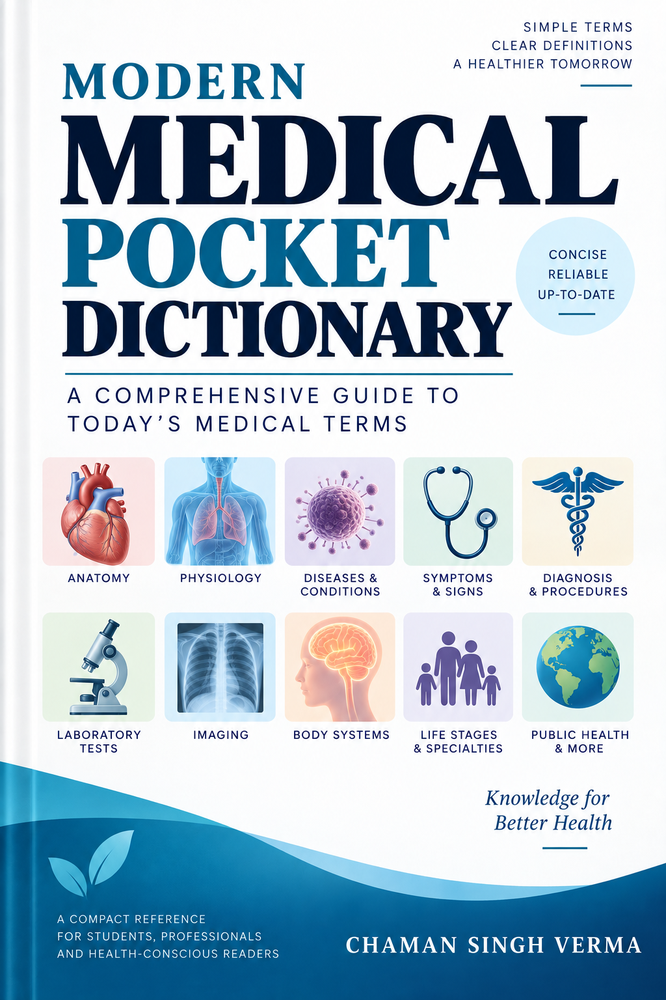

# The Modern Medical Pocket Dictionary

**The Modern Medical Pocket Dictionary** is a LaTeX-based medical reference organized alphabetically from A to Z. It brings together concise definitions for diseases, symptoms, clinical signs, anatomy, physiology, investigations, treatments, medicines, procedures, syndromes, and related medical terminology.

The project is intended for educational and reference use by medical students, healthcare professionals, educators, researchers, and general readers. It is not a clinical decision-support system and does not replace qualified medical advice, diagnosis, treatment, or current clinical guidance.

## Front page



## Features

- Alphabetical A–Z medical terminology chapters
- Concise, plain-language definitions
- Cross-references, alternate names, abbreviations, and British spellings
- Coverage of modern medical terminology alongside clearly labeled historical terms
- Appendices for common diseases, symptoms, signs, syndromes, disorders, organs, specialties, prefixes, suffixes, abbreviations, mental-health terms, and rare diseases
- A generated PDF suitable for reading and distribution
- Editorial audit scripts for checking definitions, cross-references, and appendix coverage

## Repository layout

```text
med_pocket_dict.tex        Main LaTeX document
frontpage.png              Dictionary cover image
chapters/                  Alphabetical A–Z dictionary chapters
appendices/                Reference tables and subject appendices
scripts/                   Supporting generation and audit scripts
global_audit.py            Dictionary-wide synonym and formatting audit
detailed_check.py          Appendix-to-dictionary coverage check
medical_accuracy_audit.md  Medical-content review notes
med_pocket_dict.pdf        Generated dictionary PDF
```

## Build the PDF

The document requires a working LaTeX installation with `pdflatex` and `makeindex`.

From the repository root, run:

```bash
pdflatex med_pocket_dict.tex
makeindex med_pocket_dict.idx
pdflatex med_pocket_dict.tex
pdflatex med_pocket_dict.tex
```

If `latexmk` is available, the equivalent build is:

```bash
latexmk -pdf med_pocket_dict.tex
```

The primary output is `med_pocket_dict.pdf`. Auxiliary files such as `.aux`, `.idx`, `.ind`, `.log`, and `.out` are generated during compilation.

## Run editorial audits

The repository includes lightweight Python audits that use only the local source files:

```bash
python3 global_audit.py
python3 detailed_check.py
```

Before submitting changes, also check LaTeX whitespace and patch integrity:

```bash
git diff --check
```

## Editorial conventions

- Use one canonical headword for each medical concept.
- Use alternate names and spelling variants as cross-references where possible.
- Keep plural forms as indexable alternate forms rather than separate duplicate definitions.
- Prefer current clinical terminology; label historical, obsolete, informal, or nonpreferred terms clearly.
- Avoid stigmatizing language and unsupported claims.
- Keep definitions descriptive and reference-oriented rather than individualized medical advice.
- Use concise definitions and explain specialized abbreviations on first use.
- Preserve alphabetical ordering within each letter chapter.
- Add new appendix items only when the corresponding dictionary concept is defined or intentionally cross-referenced.

## Contributing

When adding or revising an entry:

1. Search the repository for an existing headword or equivalent term.
2. Decide whether the change should be a new definition, synonym, alternate spelling, or cross-reference.
3. Place the entry in the chapter matching its canonical headword.
4. Use `\synonyms` only for recognized alternate names or searchable forms.
5. Run the editorial audits and `git diff --check`.
6. Review the generated PDF when a change affects layout, tables, or long definitions.

Please keep changes focused and explain terminology decisions in the commit message or pull request description.

## Medical and editorial disclaimer

This dictionary is an educational and reference work. Definitions may contain errors, omissions, or simplified explanations, and medical terminology and clinical guidance change over time. Nothing in this project constitutes professional medical advice, diagnosis, treatment, or a personalized recommendation. Clinical decisions must rely on current evidence, official guidance, local protocols, and qualified healthcare professionals.

## Author

Chaman Singh Verma

## License

No license is currently specified in this repository. Add an explicit license file before redistributing the source or generated materials.
